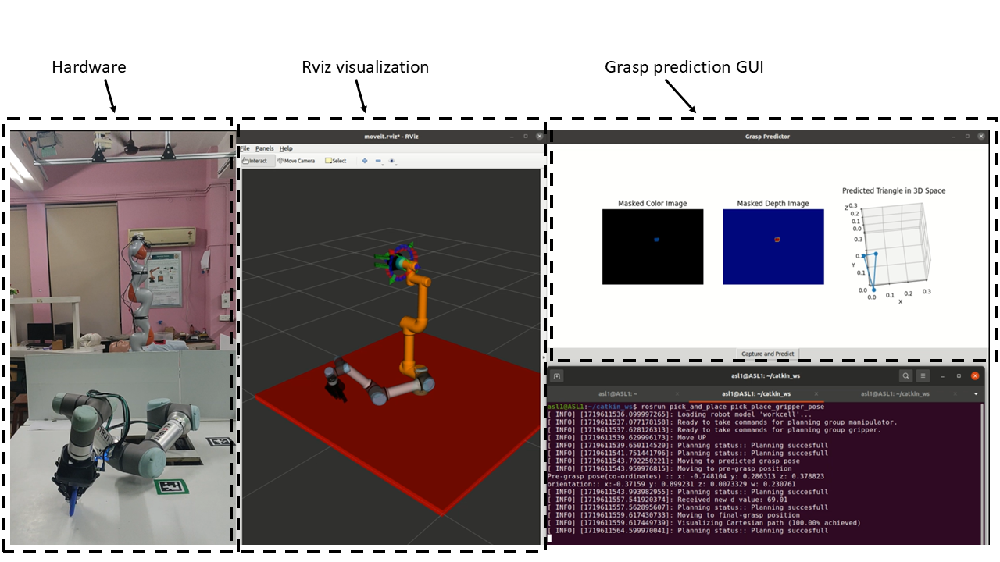

# **Grasp Planning for Three-Finger Grippers Using Triangular Representation - Dataset & Code Repository**

This repository contains the dataset, neural network models, simulation setups, and code for **grasp planning using a three-finger gripper** with a **triangular representation**.

## **Repository Structure**

```
📂 3FG_dataset_and_grasp_planning
│── 📂 Blender files
│   └── RGBD_creation_script.blend
│
│── 📂 Grasp planning network
│   ├── Dataloader.py
│   ├── Loss_and_accuracy.py
│   ├── Vanilla_CNN_models.py
│   ├── grasp_planning_vanilla_architectures.py
│   ├── grasp_planning_vanilla_architectures_wandb.py
│   ├── masking_script.py
│   ├── prediction_file.py
│
│── 📂 PyBullet grasp quality setup
│   └── Grasp quality file.py
│
│── 📂 setup_videos
│── 📜 grasp_planning_vanilla_architectures.py
```

- The `main` branch contains **neural network models**, **grasp planning code**, and **simulation setup**.
- The `Grasp-it` branch contains **Graspit! files** and **installation instructions** for data generation.

---

## **Dataset Details**

The dataset consists of training and evaluation sets, each containing the following folders:

```
📂 Dataset_2
│── 📂 egad_train_set_0.12
│   ├── 📂 .obj files
│   ├── 📂 depth
│   ├── 📂 masked_depth
│   ├── 📂 masked_rgb
│   ├── 📂 rgb
│   ├── 📜 merged_top_1_entries_train_0.12.csv
│── 📂 egad_eval_set_0.12
│   ├── 📂 .obj files
│   ├── 📂 depth
│   ├── 📂 masked_depth
│   ├── 📂 masked_rgb
│   ├── 📂 rgb
│   ├── 📜 merged_top_1_entries_eval_0.12.csv
```

### **CSV File Structure**

The `merged_top_1_entries_train_0.12.csv` file contains grasp data with the following columns:

```
X    Y    Z    roll    pitch    yaw    x_q    y_q    z_q    w_q    lateral_joint_1    lateral_joint_2    d    epsilon_quality    volume_quality    X_1    Y_1    Z_1    X_2    Y_2    Z_2    X_3    Y_3    Z_3
```

Example entry:

```
-0.0469535052  -0.0124470604  0.2256165198  -2.03820989  -0.04931553702  2.417115371  0.2896184348  0.8007100956  -0.4825257596  -0.205312923  0.00365815334  -0.00365815334  82.66188198  0.2211280358  1.33519805  -0.1142677031  0.04712739177  0.2300531193  -0.003970866176  -0.09817357974  0.2031786807  0.04469225149  -0.04586944539  0.2391811599
```

---

## **Grasp Planning Approach**

1. **Dataset Collection**:
   - RGBD images and grasp labels using **Blender & Graspit!**.
   - Dataset is inside [Dataset_2.zip file](Dataset_2.zip)
2. **Neural Network for Grasp Prediction**:
   - Uses a **Vanilla CNN model** for grasp pose estimation.
3. **Simulation Setup**:
   - **PyBullet-based grasp evaluation**.
   - **ROS-based visualization & execution**.

---

## **Running the ROS-based Grasp Execution**

```sh
rosrun pick_and_place grasp_prediction.py
rosrun pick_and_place pick_place_gripper_pose
```

---

## **PyBullet Grasp Quality Simulation**

📌 The ![Grasp quality file]\(pybullet grasp quality setup/Grasp quality file.py)

---

## **Graspit! Data Generation**

📌 **Available in **`Grasp-it`** branch**:

- Instructions on how to install and use **Graspit!** for generating grasp datasets.

---

## **Hardware Trials**


| [](https://youtu.be/i2BODHclz6M) | [](https://youtu.be/7vDVp1h4Ydw) |
| --- | --- |
| [](https://youtu.be/gKLEz_waeV8) | [](https://youtu.be/g_tg9Y3nOA4) |
| [](https://youtu.be/IRkv-CzLW2Y) | [](https://youtu.be/TvEhQjx80Uw) |
| [](https://youtu.be/kzqKcuT7bY8) | [](https://youtu.be/NyurH-DUuHU) |
| [](https://youtu.be/-6s4hpb3Slk) | [](https://youtu.be/jcGFYyq38Kc) |

---

## **Paper & Citation**

📌 **[Paper Link - To Be Added]**

If you use this repository, please cite:

```
@article{yourpaper2024,
  author  = {Your Name and Co-authors},
  title   = {Title},
  journal = {Journal Name},
  year    = {2024},
  volume  = {X},
  number  = {Y},
  pages   = {Z},
  doi     = {10.XXXX/yourdoi}
}
```

---

